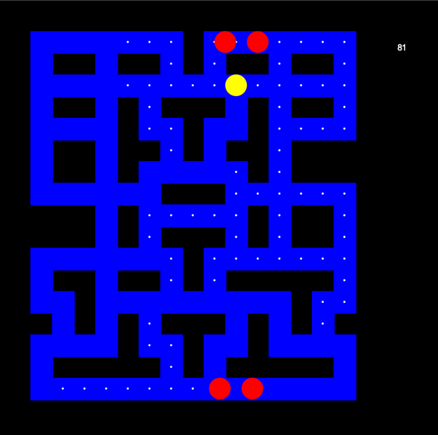
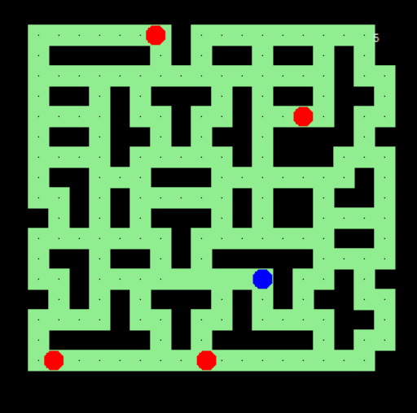
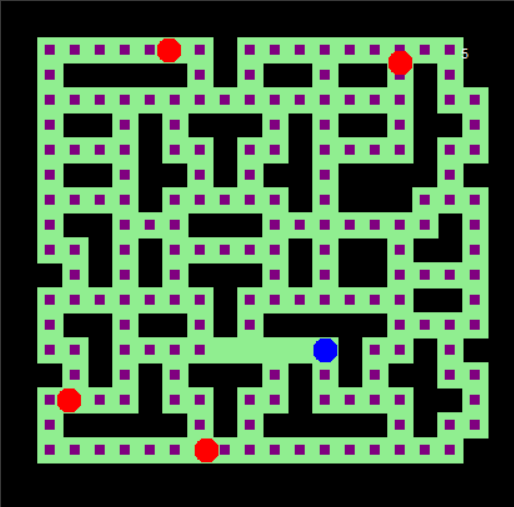

# Proyecto Herramientas Computacionales: El arte de la programacion

Diego Ponce de León Betanzos A01664407

Kamila Jeannette Martinez Ibarra A01711833

Andre ...

## Packman
### Tablero Inicial

Cambios Realizados

1.  Cambios al Tablero:

    * Se modificó la lista tiles para cambiar el diseño del tablero. Ahora el tablero tiene una distribución diferente de paredes y caminos.
    * Se cambió el color del camino a verde claro (light green) modificando la llamada a path.color('light green') dentro de la función world().
    
2.  Cambio de Forma y Color del Alimento:

    * Se cambió la forma del alimento de un punto a un cuadrado amarillo. Esto se logró modificando el código dentro de la condición if tile == 1: en la función world(). En lugar de food_turtle.dot(8), ahora se dibuja un cuadrado amarillo de 8x8 píxeles.
    
3.  Velocidad de los Fantasmas:

    * Se incrementó la velocidad de los fantasmas reduciendo el tiempo de espera en la función turtle.ontimer(move, 50). Originalmente era 100, lo que significa que la función move() se llamaba cada 100 milisegundos. Ahora se llama cada 50 milisegundos, haciendo que los fantasmas se muevan el doble de rápido.

## Memoria
// Contenido...

## Tic Tac Toe
// Contenido...