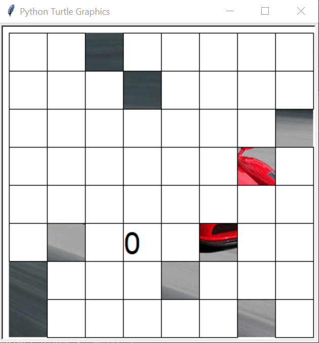
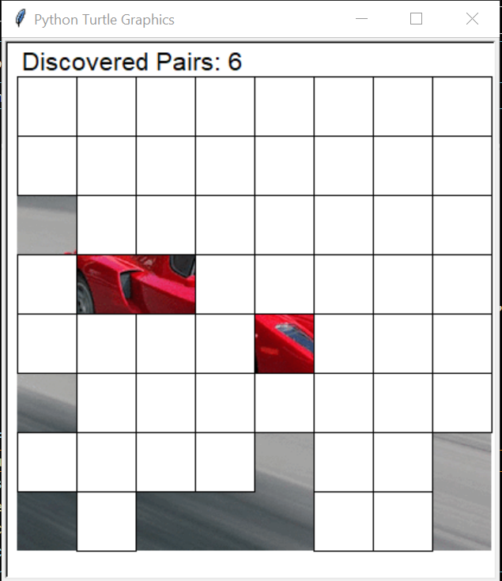
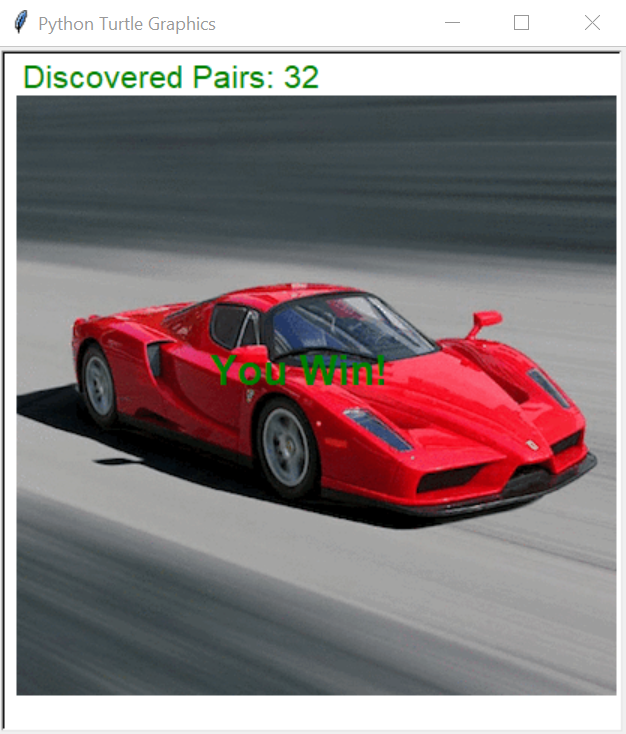
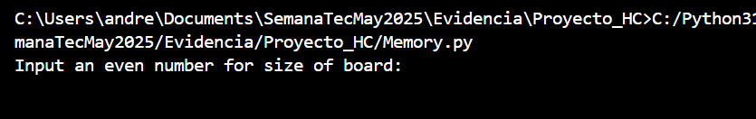
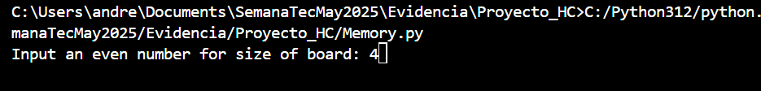
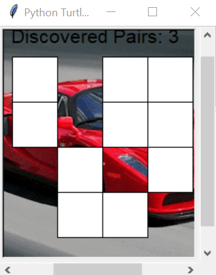
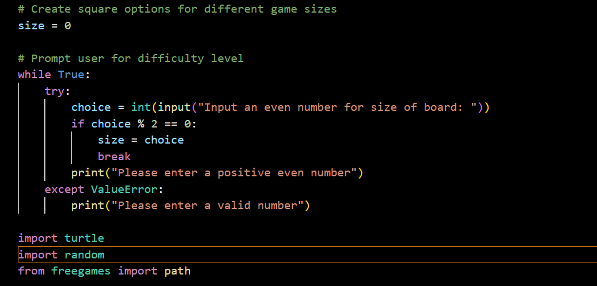
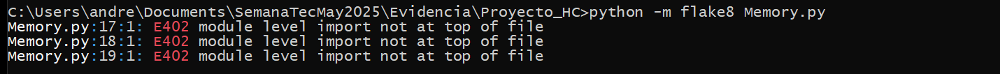

# Proyecto Herramientas Computacionales: El arte de la programacion

Diego Ponce de León Betanzos A01664407

Kamila ...

Andre Zaldivar Agle A01709535

## Packman
// Contenido...

## Memoria

### Descripción

Este juego es uno de los que ofrece la colección gratis de juegos en python que 
se llama FreeGames. Son programas de juegos sencillos para la experimentación y 
el aprendizaje al cambiar/modificarlos.

Este juego es uno en el que aparece una tabla de cartas boca abajo, donde cada carta 
tiene una copia no visible. El objetivo es voltear una carta, y luego su copia para 
poder descartar ese par. Una vez volteados todos los pares y cartas, se ha concluido 
el juego. 

El código fuente, copiado y subido para iniciar este proyecto, produce el siguiente juego:



### Reto 1

Ahora, el primer reto es agregar al juego una etiqueta que muestre la cantidad de 
pares que el usuario lleva ya descubiertos:



Como se puede ver, se agregó padding en la parte de arriba de la tabla, donde aparecen 
las palabaras 'Discovered Pairs', seguidas por el número actual de pares que han sido 
descubiertos, mejorando la experiencia del usuario.

### Reto 2

Luego, al descubrir todos los pares del juego, el juego no produce ningún tipo de feedback 
para indicarle al usuario que haya pasado algo significante, y por lo tanto, se quiere 
agregar una funcionalidad al juego que detecte cuando todos los pares han sido volteados, 
y mostrarle al usuario un mensaje que indique el final del juego:



Ahí aparece el mensaje de 'You Win', para indicarle al usuario que ya se acabó el juego.

### Reto 3

Finalmente, se nota que este juego siempre produce una tabla del mismo tamaño. Es decir, las 
mismas dimensiones. ¿Qué tal si alguien quiere jugar con una tabla más chica, o más grande?

Para eso, se implementó una la funcionalidad al código que hiciera que la producción de la 
tabla, y todo lo que eso implique, sea de forma dinámica, según el input del usuario.

Se le pregunte al usuario lo siguiente:



Y digamos que el usuario ingresa '4', para producir una tabla de 4x4 casillas:



En ese caso el programa ahora producirá una tabla de solo 16 casillas, y con un tamaño de ventana
apropiada. 



Como se puede ver, el juego es muy funcional incluso con estos cambios lógicos.

### Reto 4

Siguiendo las buenas prácticas de código para el mundo del desarrollo, se busca que este código, 
despúes de todos sus cambios, siga un formato adecuado para el futuro de su legibilidad, 
mantenimiento, y más. 

Así que se le va a aplicar la convención popular PEP8 para código de python, y el programa se 
va a probar con una herramiento valorosa y gratis que se puede usar para detectar cualquier línea 
del programa que no sea adecuado según PEP8 formato.

Al programa se le hicieron los cambios necesarios para poder cumplir con este formato. Pero a 
continuación, se explicará por qué este caso es uno en el que no se puede cumplir al 100% con el
formato de PEP8.

En el reto 3, se tuvo que hacer dinámica el juego según un input por parte del usuario. Desafortunademente, 
es necesario agregar esa parte del código antes de importar las librerías de turtle para que no crashea 
el programa. 



Esto choca con lo que busca flake8 y PEP8, que todos los imports sucedan al inicio del programa, y por 
lo tanto, los imports van a producir un error de flake8 cada uno:



### Conclusión

Sin embargo, se lograron los cambios que se plantearon, y correo el programa perfectamente bien a pesar 
de no pasar las pruebas rigidas del formato PEP8, y se puede al correr el archivo **Memory.py** 
con el siguiente comando:

    ```powershell
    python Memory.py
    ```
    (o si tienes otra versión de python igual)

## Tic Tac Toe
// Contenido...
